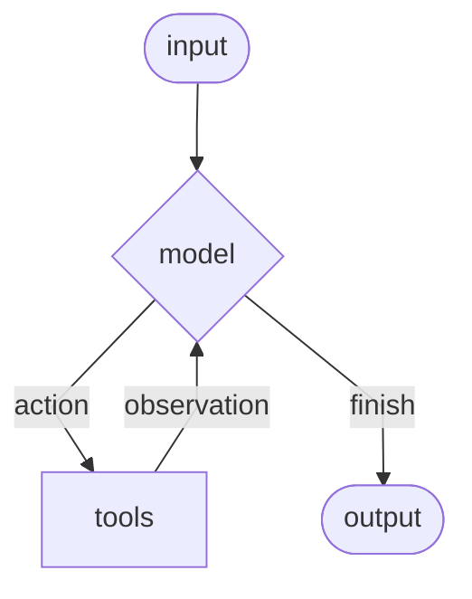
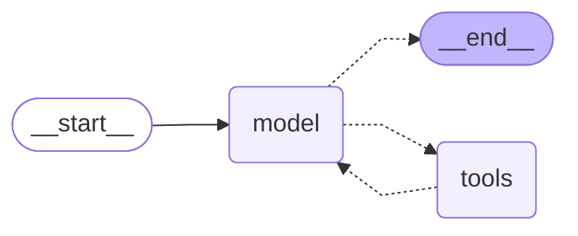

# 1. ReAct Agent

**ReAct** (Reasoning and Acting) is an agent architecture introduced in a 2022 paper, [Synergizing Reasoning and Acting in Language Models](https://arxiv.org/abs/2210.03629), that remains widely used today.

![[agent_header.png]]

### Core Concept
An agent consists of an LLM calling tools in a loop:
1. **Reasoning**: The LLM decides which tool to call
2. **Acting**: The tool is invoked
3. **Observing**: The LLM receives tool feedback and continues
#### Diagram


### Architecture
- **Agent Node**: Calls the LLM to decide next action
- **Tools Node**: Executes tool calls made by the LLM
- **Conditional Edge**: Routes to tools if LLM makes a tool call, otherwise ends

## Building Agents

### Key Benefits
- Memory integration (short-term and long-term)
- Human-in-the-loop control
- Streaming support
- Deployment tooling (LangGraph Platform, Studio, LangSmith)

### Basic Implementation

Diagram


Code
```python
from langchain.agents import create_agent 
from langchain.chat_models import init_chat_model
from langchain_core.tools import tool

# Define a tool ------------------------
@tool
def calculator(operation: str, a: float, b: float) -> float:
    """Performs arithmetic operations"""
    # Implementation
    return result

# Create agent -------------------------
model = init_chat_model(model="openai:gpt-4o-mini", temperature=0.0)
tools = [calculator]

agent = create_agent(
    model,
    tools,
    system_prompt="YOUR PROMPT",
)

# Invoke agent -------------------------
result = agent.invoke({
    "messages": [{"role": "user", "content": "What is 3.1 * 4.2?"}]
})
```

## State Management

The graph has a typed data structure that is available to each node for the duration of the graph and can be persisted in long-term storage. You can use this to store information to share between nodes, to debug the graph, and to reset a long-running graph to an earlier time.

When you define state for a graph, you define the data types and a 'reducer' function. The reducer describes how information is added to that element. This is especially useful when a task is mapped to multiple nodes, which are executed in parallel and update state simultaneously.

### Default State Schema

```python
class AgentState(TypedDict):
    """The state of the agent."""
    messages: Annotated[Sequence[BaseMessage], add_messages]
    remaining_steps: NotRequired[RemainingSteps]
```

The default `AgentState` contains:
- **messages**: List of messages with `add_messages` reducer (appends messages to the list)
- **remaining_steps**: Tracks graph execution steps

### Custom State Schema

You can extend `AgentState` to add custom fields:

```python
from langgraph.prebuilt import AgentState
from typing import Annotated, List

def reduce_list(left: list | None, right: list | None) -> list:
    """Safely combine two lists"""
    if not left:
        left = []
    if not right:
        right = []
    return left + right

class CalcState(AgentState):
    """Extended state with operation tracking"""
    ops: Annotated[List[str], reduce_list]
```

## State Injection Pattern

Tools often need access to graph state, but the LLM cannot produce state in its tool calls since it only sees messages.
- Inject state **after** the LLM makes a tool call, but **before** the tool executes.

#### Flow Diagram
![[inject_state_diagram.png]]
1. LLM sees tool definition with only required parameters (operation, a, b)
2. LLM produces tool call with those parameters
3. **Tool Node injects state** before invoking the tool
4. Tool executes with access to full graph state

#### Implementation

```python
from langgraph.prebuilt import InjectedState
from langchain_core.tools import InjectedToolCallId
from langgraph.types import Command

@tool
def calculator_with_state(
    operation: Literal["add","subtract","multiply","divide"],
    a: Union[int, float],
    b: Union[int, float],
    state: Annotated[CalcState, InjectedState],      # Not sent to LLM
    tool_call_id: Annotated[str, InjectedToolCallId]  # Not sent to LLM
) -> Union[int, float]:
    """Calculator with state tracking"""
    # Perform calculation
    result = # ... calculation logic

    # Update custom state field
    ops = [f"({operation}, {a}, {b})"]

    # Return Command to update both messages and custom state
    return Command(
        update={
            "ops": ops,
            "messages": [
                ToolMessage(f"{result}", tool_call_id=tool_call_id)
            ],
        }
    )
```

## The Command Object

`Command` allows tools to:
1. **Update state** via the `update` parameter (dictionary of state fields to update)
2. **Control flow** via the `goto` parameter (optional, directs graph routing)

This is particularly powerful because `create_react_agent` handles Command objects automatically when returned from tools.

### How It Works
1. Tool node invokes the tool
2. Tool returns Command object
3. Tool node passes Command directly to graph
4. Graph applies state updates specified in Command

## Message Flow Example

For the query "What is 3.1 * 4.2?":

1. **User Input** → System prompt + tool descriptions + user message
2. **LLM Response** → AIMessage with tool_calls: `calculator(operation="multiply", a=3.1, b=4.2)`
3. **Tool Execution** → ToolMessage with content: `13.02` and matching `tool_call_id`
4. **LLM Final Response** → "3.1 multiplied by 4.2 is 13.02"

## Key Principles

### Context Engineering
- **State injection** prevents burdening the LLM with graph state details
- LLM only sees relevant tool parameters in its context
- Graph infrastructure handles state management automatically

### Parallel Tool Calls
When the LLM makes multiple tool calls in one message (e.g., "What is 3.1 * 4.2 + 5.5 * 6.5?"):
- Tool node executes all tools in parallel
- All results are collected
- LLM receives all ToolMessages and proceeds

### Reducer Functions
Custom reducers define how state updates are merged:
- Critical for parallel operations
- Handles None/empty values safely
- Enables flexible state accumulation patterns

## References

- Notebook: [0_create_agent.ipynb](notebooks/0_create_agent.ipynb)
- LangGraph Documentation: [create_react_agent](https://langchain-ai.github.io/langgraph/reference/agents/)
- ReAct Paper: [Synergizing Reasoning and Acting in Language Models](https://arxiv.org/abs/2210.03629)
- Tool Node Implementation: [prebuilt/tool_node.py](https://github.com/langchain-ai/langgraph/blob/main/libs/prebuilt/langgraph/prebuilt/tool_node.py)


---
# Examples

**0_create_agent.ipynb - Create Agent Component**

Learn to use the create_agent component. This component:

- Implements a ReAct (Reason-Act) loop that is the foundation for many agents
- Is easy to use and quick to set up
- Is the core building block for the Deep Agent

**1_todo.ipynb - Task Planning Foundations**

Learn to implement structured task planning using TODO lists. This notebook introduces:

- Task tracking with status management (pending/in_progress/completed)
- Progress monitoring and context management
- The `write_todos()` tool for organizing complex multi-step workflows
- Best practices for maintaining focus and preventing task drift

**2_files.ipynb - Virtual File Systems**

Implement a virtual file system stored in agent state for context offloading:

- File operations: `Is()`, `read_file()`, `write_file()`
- Context management through information persistence
- Enabling agent "memory" across conversation turns
- Reducing token usage by storing detailed information in files

**3_subagents.ipynb - Context Isolation**

Master sub-agent delegation for handling complex workflows:

- Creating specialized sub-agents with focused tool sets
- Context isolation to prevent confusion and task interference
- The `task()` delegation tool and agent registry patterns
- Parallel execution capabilities for independent research streams

**4_full_agent.ipynb - Complete Research Agent**

Combine all techniques into a production-ready research agent:

- Integration of TODOs, files, and sub-agents
- Real web search with intelligent context offloading
- Content summarization and strategic thinking tools
- Complete workflow for complex research tasks