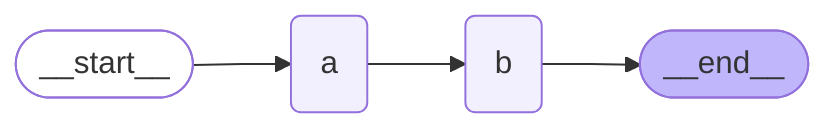
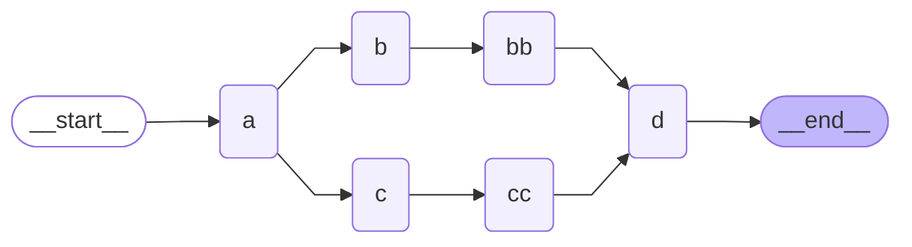
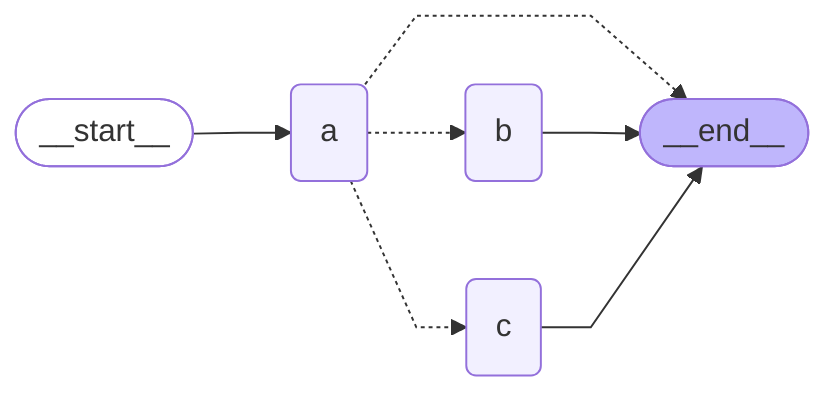

# LangGraph

A framework providing durable runtime for AI agents and applications.

## Key Benefits of LangGraph

1. Latency Management
    - LLMs have high latency
    - **Parallel execution**: Run N tasks in parallel -> reduce latency by factor of N
    - **Streaming**: Optimize time-to-first-token for interactive applications
2. Reliability
    - Long-running agents can fail expensively
    - **Checkpointing**: Saves application state at each step
    - **Resume capability**: Restart exactly where it failed
    - State persistence is a core feature for resilient applications
3. Non-deterministic Responses
    - LLMs produce variable results across calls and models
    - **Human-in-the-loop**: Suspend agent for human approval
    - **Tracing & evaluation**: Via LangSmith for testing and monitoring

## Core Concepts

| Component     | Description                                                |
| ------------- | ---------------------------------------------------------- |
| State         | **Data** that flows through the graph                      |
| Node          | **Functions** that operate on the data                     |
| Edges         | Control Flow                                               |
| Checkpointing | State persistence across time and failures                 |
| Control Flow  | Can be interrupted and resumed (enables human-in-the-loop) |

### State
- Data supplied to, updated by, and returned from the graph
- **Graphs are stateless** - state flows through them
- Shared by all nodes
- Define as: `TypedDict`, `dataclass`, or `BaseModel`

### Nodes
- Simply **functions**: `node(state) -> state_update`
- Receive current state as input
- Return updates to state
- Can access and modify shared state
- Can update partial state by returning `dict`

### Edges
- Define control flow between nodes
- Types: static or conditional
- Execution: parallel or series

### Execution Flow
1. Initialise state when graph is invoked
2. Runtime selects and executes nodes
3. Nodes receive current state and return updates
4. State is updated with node results
5. Final state is returned on completion

---

## Building Graphs

**Essential Steps:**
1. Define state (`TypedDict` / `dataclass` / `Pydantic`)
2. Define node functions
3. Create `StateGraph` with state
4. Add nodes and edges (`START` -> `nodes` -> `END`)
5. Compile the graph
6. Invoke with initial state

**Key Points:**
- All nodes share the same state
- Node return values overwrite/update state fields
- Control flow determines execution order
- Runtime handles initialisation, execution, and updates

### Basic Pipeline Example



```python
from typing import TypedDict
from langgraph.graph import END, START, StateGraph

############################################################
# Setup
class State(TypedDict):
    nlist: list[str]
    extra: list[str]

# Node updating entire State
def node_a(state: State) -> State:
    print(f"node a is receiving {state['nlist']}")
    note = "Hello world from Node a"
    return State(nlist = [note], extra = [note])

# Node updating part of State
def node_b(state: State) -> State:
    print(f"node b is receiving {state['nlist']}")
    note = "Hello world from Node b"
    return {"extra": [note]}

builder = StateGraph(State)
builder.add_node("a", node_a)
builder.add_node("b", node_b)
builder.add_edge(START, "a")
builder.add_edge("a", "b")
builder.add_edge("b", END)
graph = builder.compile()

############################################################
# Execution
initial_state = State(nlist = ["Hello node a"])
result = graph.invoke(initial_state)
print(result)
```

---

## Control Flow

### Static Edges

> Example: [[langgraph-example-edge]]

**Basic Behaviour**
- Always taken (solid lines in visualisation)
- Serial execution: Node runs after parent completes
- Parallel execution: Multiple nodes run simultaneously via `add_edge()` from same parent



### Conditional Edges

> Example: [[langgraph-example-conditional-edge]]

Conditional edges enable **dynamic routing** where the next node to execute depends on the current state at runtime.



**Approach 1: Using `add_conditional_edges` with a Routing Function**

This approach **separates routing logic from node logic**.

```python
def conditional_edge(state: State) -> Literal["b", "c", END]:
    select = state["nlist"][-1]
    if select == "b":
        return "b"
    elif select == "c":
        return "c"
    else:
        return END

# Add to graph
builder.add_conditional_edges("a", conditional_edge)
```

**Approach 2: Using `Command` in Node Return**

Bundle the routing decision directly in the node:

```python
def node_a(state: State) -> Command[Literal["b", "c", END]]:
    select = state["nlist"][-1]
    if select == "b":
        next_node = "b"
    # ... routing logic ...

    return Command(
        update = State(nlist = [select]),
        goto = [next_node]
    )
```

`Command` allows you to:
- **`update`**: Update the state
- **`goto`**: Specify the next node(s) to execute

**Implementation Notes:**
- Type annotations on `Command` enable accurate graph visualisation
- `goto` can be a list of nodes for multiple paths
- Routing decisions are checked at runtime, so node names must match exactly

### Super Steps & Execution Behaviour

**Super Steps**
- Execution unit where all active nodes must complete before continuing
- All node outputs stored to state before next super step begins
- Enables synchronised parallel execution

**Critical Rule**: Edges define control flow, NOT data access
- Nodes see full current graph state (including parallel branch updates)
- Nodes in same super step see identical input state

**Execution Timing**
- Normal: Node activates when parent completes
- Deferred: Outputs added in same super step as later nodes

---

## State Management

### Reducer Functions

Reducer provides custom behaviour to update the state.

**Problem**: Multiple parallel nodes writing to same state key -> last write overwrites

**Solution**: Use reducer in state definition
```python
class State(TypedDict):
    nlist: Annotated[list[str], operator.add]
```

**How it works**:
- Reducer merges values from parallel branches
- Common pattern: `operator.add` for lists
- Custom reducers supported
- Reducer merges values before next super step

### Memory and Persistence

> Example: [[langgraph-example-memory]]

![[langgraph-memory.png]]
*Source: https://academy.langchain.com*

**Checkpointer**
- Stores state snapshots at the end of each super step
- Gives graph persistent memory across runs
- Enables failure recovery and state rollback

**Thread**
- Collection of checkpoints over time
- Identified by `thread_id`
- Same `thread_id` -> shared state history
- Different `thread_id` -> separate conversation histories

**Why Use Checkpointers?**
1. **Failure recovery**: Restore state and resume without losing progress
2. **Time-travel**: Roll back to earlier checkpoint when needed
3. **Persistence**: State survives beyond graph execution
4. **Interrupts**: Resume execution from exact suspension point

**Implementations**
- **`InMemorySaver`**: In-memory storage (simplest)
- **`PostgresSaver`**: PostgreSQL database
- **`SQLiteSaver`**: SQLite database

**Usage Pattern**
```python
from langgraph.checkpoint.memory import InMemorySaver

# Setup
memory = InMemorySaver()
config = {"configurable": {"thread_id": "1"}}
graph = builder.compile(checkpointer=memory)

# Execute with persistence
result = graph.invoke(input_state, config)
```

**Key Behaviour**:
- Without checkpointer: Each invocation starts fresh
- With checkpointer: State accumulates within same thread across runs

### Interrupts (Human-in-the-Loop)

> Example: [[langgraph-example-interrupt]]

`interrupt()` pauses graph execution to wait for external input, then resumes exactly where it stopped.

**Requirements**: Must use a checkpointer to persist state between pause and resume.

**Why Use Interrupts?**
- **Human approval** before sensitive operations
- **Admin review** for unexpected situations
- **User input** to resolve ambiguities

**Basic Pattern**

Raise interrupt in node:
```python
from langgraph.types import interrupt

def node_a(state: State):
    # ... logic ...
    user_input = interrupt(f"Need approval for: {action}")
    # Code continues after resume with user_input value
    return Command(update=state, goto=next_node)
```

Handle interrupt and resume:
```python
result = graph.invoke(input_state, config)

if '__interrupt__' in result:
    msg = result['__interrupt__'][-1].value
    human_response = input(msg)

    # Resume with same thread_id
    result = graph.invoke(Command(resume=human_response), config)
```

**Execution Flow**
1. `interrupt()` called -> graph pauses
2. State checkpointed
3. Interrupt message returned in `result['__interrupt__']`
4. External input collected (can take seconds to hours)
5. Resume with `Command(resume=value)` using same `thread_id`
6. Node replays from beginning with interrupt value supplied

**Key Behaviours**
- **Node Replay**: Nodes restart from the top (not mid-execution) on resume
- Code before `interrupt()` re-executes
- Previously seen interrupts auto-supplied (won't hit same interrupt twice)
- **Multiple Interrupts**: Same node can have multiple sequential interrupts
- Parallel nodes: `result['__interrupt__']` is a list (access via `[-1]` for most recent)
- **Critical**: Must use same `thread_id` when resuming to restore checkpointed state

---

## Production Patterns

> Example: [[langgraph-example-email-agent]]

### State Schema Design

**Analyze node dependencies first**: Map what data each node needs before defining schemas.

**Separate complex schemas**: Extract structured data types for clarity
```python
class EmailClassification(TypedDict):
    intent: Literal["question", "bug", "billing", "feature", "complex"]
    urgency: Literal["low", "medium", "high", "critical"]
    topic: str
    summary: str

class EmailAgentState(TypedDict):
    email_content: str
    classification: EmailClassification | None
    search_results: list[str] | None
    draft_response: str | None
```

**When to skip reducers**:
- Single-item processing doesn't need `Annotated` reducers.
- Default replacement is sufficient.

### Structured LLM Output

**Problem**: Parsing free-form LLM responses is error-prone

**Solution**: `with_structured_output()` enforces schema compliance
```python
structured_llm = llm.with_structured_output(EmailClassification)
classification = structured_llm.invoke(prompt)  # Returns typed dict
```

### Error Handling for Long-Running Agents

**Graceful degradation**: Capture errors as strings instead of crashing
```python
try:
    search_results = search_api.query(query)
except SearchAPIError as e:
    # Store error - LLM can see and adapt
    search_results = [f"Search unavailable: {str(e)}"]

return {"search_results": search_results}
```

### Robust State Access

**Use `.get()` with defaults**: Prevent empty values confusing LLM
```python
classification.get('urgency', 'medium')  # Sensible default
classification.get('intent', 'unknown')   # Clear fallback
```

### Conditional Routing Patterns

**Route based on state properties**:
```python
def write_response(state) -> Command[Literal["human_review", "send_reply"]]:
    needs_review = (
        state['classification'].get('urgency') in ['high', 'critical'] or
        state['classification'].get('intent') == 'complex'
    )

    goto = "human_review" if needs_review else "send_reply"
    return Command(update={"draft_response": response}, goto=goto)
```

### Interrupt Best Practices

**Place `interrupt()` at node start**: Minimize re-execution on resume
```python
def human_review(state) -> Command[Literal["send_reply", END]]:
    # interrupt() FIRST - code before this re-runs on resume
    decision = interrupt({
        "draft": state['draft_response'],
        "action": "Review and approve"
    })

    # Process decision after resume
    if decision.get("approved"):
        return Command(update={...}, goto="send_reply")
    else:
        return Command(update={}, goto=END)
```

### Parallel Execution for Performance

**Multiple edges from one node -> parallel execution**:
```python
builder.add_edge("classify", "search_docs")     # Path 1
builder.add_edge("classify", "create_ticket")   # Path 2
builder.add_edge("search_docs", "write_response")
builder.add_edge("create_ticket", "write_response")
```

Both `search_docs` and `create_ticket` run in parallel, then converge at `write_response`.

### Batch Processing with Threads

**Separate thread per item**:
```python
needs_review = []

for i, email in enumerate(email_batch):
    thread_id = uuid.uuid4()  # Unique thread per email
    config = {"configurable": {"thread_id": thread_id}}
    result = app.invoke(email, config)

    if "__interrupt__" in result:
        result['thread_id'] = thread_id  # Track for later resume
        needs_review.append(result)
```

### Separation of Concerns

**Agents coordinate, services execute**:
- Agent stores ticket reference -> ticketing system manages tickets
- Agent drafts response -> email service sends messages
- Agent searches -> search API returns results

**Keep nodes focused**: Each node handles one responsibility.

---

## Setup

### Prerequisites

- **OpenAI API key**: https://platform.openai.com/api-keys
- **LangSmith API key**: https://docs.langchain.com/langsmith/create-account-api-key
