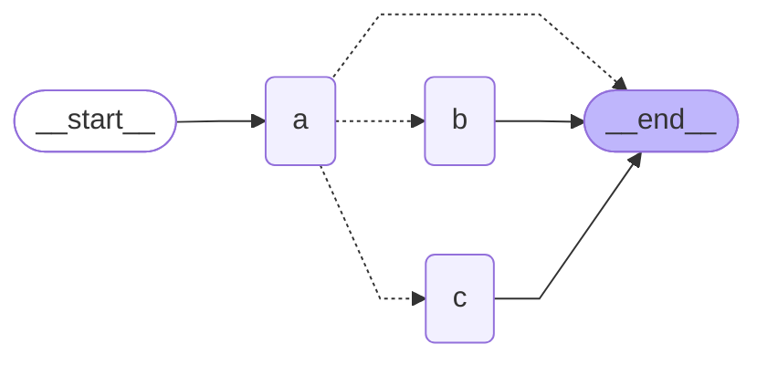

## Graph Diagram




## Method 1: `add_conditional_edges` with a Routing Function


```python
import operator
from typing import TypedDict, Annotated, Literal
from langgraph.graph import StateGraph, END, START

# Define state
class State(TypedDict):
    nlist: Annotated[list[str], operator.add]

# Define nodes
def node_a(state: State):
    return
def node_b(state: State) -> State:
    return(State(nlist = ["B"]))
def node_c(state: State) -> State:
    return(State(nlist = ["C"]))

# Define conditional edge
def conditional_edge(state: State) -> Literal["b", "c", END]:
    select = state["nlist"][-1]
    if select == "b":
        return "b"
    elif select == "c":
        return "c"
    elif select == "q":
        return END
    else:
        return END

# Build graph
builder = StateGraph(State)
builder.add_node("a", node_a)
builder.add_node("b", node_b)
builder.add_node("c", node_c)

builder.add_edge(START, "a")
builder.add_conditional_edges("a", conditional_edge)

graph = builder.compile()
```


### Method 2: `Command` in Node Return

```python
import operator
from typing import TypedDict, Annotated, Literal
from langgraph.graph import StateGraph, END, START
from langgraph.types import Command

# Define state
class State(TypedDict):
    nlist: Annotated[list[str], operator.add]

# Define nodes
def node_a(state: State) -> Command[Literal["b", "c", END]]:
    select = state["nlist"][-1]
    if select == "b":
        next_node = "b"
    elif select == "c":
        next_node = "c"
    elif select == "q":
        next_node = END
    else:
        next_node = END

    return Command(
        update = State(nlist = [select]),
        goto = [next_node]
    )

def node_b(state: State) -> State:
    return(State(nlist = ["B"]))

def node_c(state: State) -> State:
    return(State(nlist = ["C"]))

builder = StateGraph(State)

builder.add_node("a", node_a)
builder.add_node("b", node_b)
builder.add_node("c", node_c)

builder.add_edge(START, "a")
builder.add_edge("b", END)
builder.add_edge("c", END)

graph = builder.compile()
```